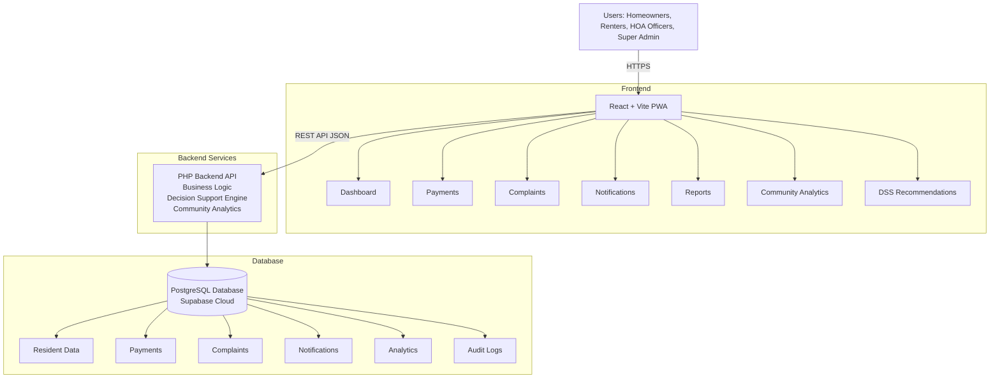
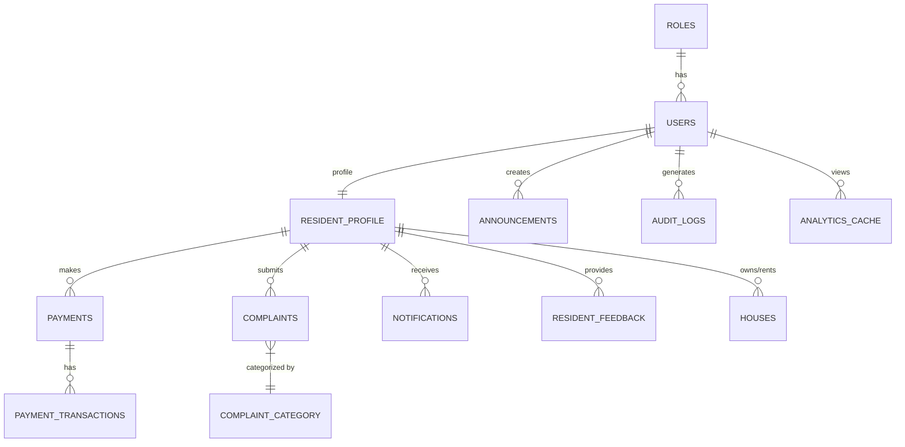

# SmartHOA System Architecture

## High-Level Architecture


## Why this architecture?
A clean **Two-Tier Web Architecture** with a React PWA frontend and PHP REST API backend connected to a cloud PostgreSQL database. This is simple, maintainable, and production-ready.

**Advantages:**
- ✅ Easier to maintain
- ✅ Single backend service to deploy
- ✅ Straightforward debugging
- ✅ Real-world architecture for community management

## Tech Stack
| Layer | Technology |
| --- | --- |
| Frontend | React + Vite |
| Styling | Tailwind CSS |
| Routing | React Router |
| State | Zustand |
| Backend | PHP REST API |
| Authentication | JWT |
| Database | PostgreSQL (Supabase) |
| Charts | Recharts |
| PWA | Vite PWA Plugin |
| File Storage | Supabase Storage |

## Folder Structure
```text
SmartHOA/
├── frontend/
│   ├── src/
│   │   ├── components/
│   │   ├── pages/
│   │   ├── layouts/
│   │   ├── hooks/
│   │   ├── services/
│   │   ├── store/
│   │   ├── assets/
│   │   ├── utils/
│   │   ├── router/
│   │   └── App.jsx
├── backend/
│   ├── controllers/
│   ├── models/
│   ├── routes/
│   ├── middleware/
│   ├── services/
│   ├── helpers/
│   ├── config/
│   ├── uploads/
│   └── index.php
├── database/
└── docs/
```

## Data Flow Examples

### Complaint Submission
1. Resident submits complaint via **React PWA**
2. Resident selects **Category** and describes the issue
3. **PHP API** saves complaint to Database
4. Officer reviews and assigns **Priority Level**
5. Officer Dashboard and Analytics are updated
6. DSS Recommendations are generated based on complaint trends

### Decision Support Flow
1. Payments, Complaints, Notifications data in **Database**
2. **Analytics Engine** generates KPIs
3. **Decision Rules** trigger Recommendations (e.g. Collection Rate < 75% -> "Send reminders")
4. **Officer Dashboard** displays Recommendations

## Database Design (ERD)

### Core Modules
1. **Users** (`users`): Stores login credentials.
2. **Roles** (`roles`): Stores permissions.
3. **Resident Profiles** (`resident_profiles`): Stores resident information.
4. **Houses** (`houses`): Stores property information.
5. **Payments** (`payments`): Monthly dues.
6. **Payment Transactions** (`payment_transactions`): Payment history.
7. **Complaints** (`complaints`): Resident concerns.
8. **Complaint Categories** (`complaint_categories`): Maintenance, Noise, Security, Parking, Utilities, Others.
9. **Announcements** (`announcements`): HOA announcements.
10. **Notifications** (`notifications`): System alerts.
11. **Resident Feedback** (`resident_feedback`): Resident satisfaction.
12. **Analytics** (`analytics_cache`): Stores generated KPIs.
13. **Audit Logs** (`audit_logs`): Tracks every important action.

### Simplified ERD

