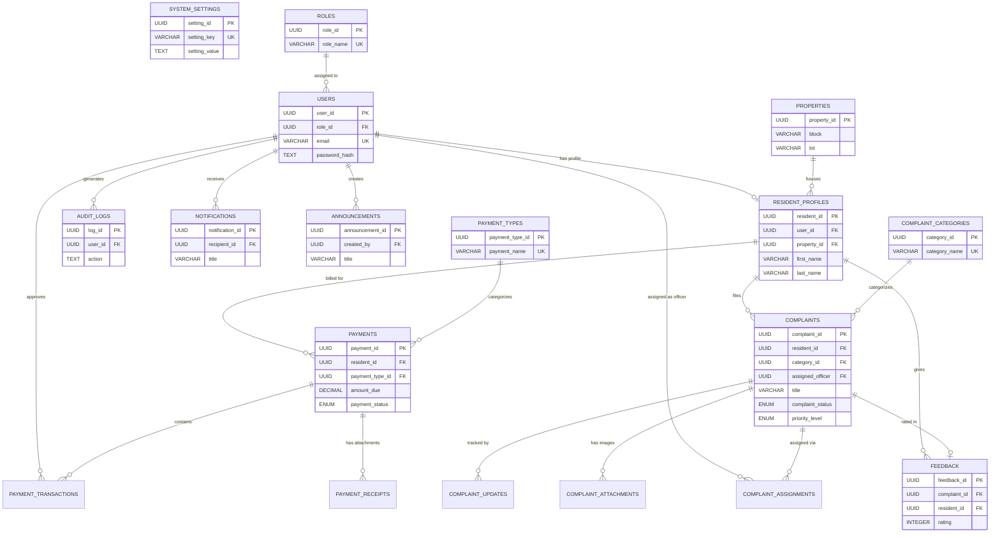

# SmartHOA Professional ERD (Crow's Foot Notation)

This Entity-Relationship Diagram utilizes Crow's Foot notation to represent the exact PostgreSQL schema and cardinality rules within the SmartHOA system.

